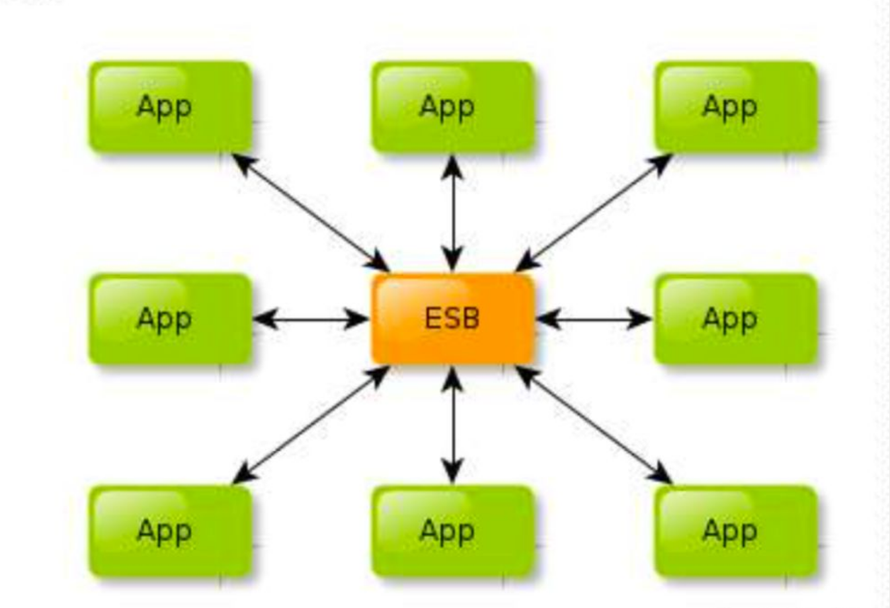

-----
* [架构概念](#架构概念)
  * [SOA](#SOA)
  * [ESB](#ESB)
  * [微服务](#微服务)
  * [服务网格](#服务网格)
* [服务概念](#服务概念)
  * [IAAS](#IAAS)
  * [PASS](#PASS)
  * [SAAS](#SAAS)
* [发布概念](#发布概念)
  * [持续集成](#持续集成)
  * [持续交付](#持续交付)
  * [持续部署](#持续部署)
* [分布式概念](#分布式概念)
----

# 架构概念

## SOA

> 面向服务的架构(Service Oriented Architecture),一种架构设计理念,多个服务相互依赖并最终提供一系列完整功能,各个服务独立部署,服务之间通过网格调用

## ESB

> 企业服务总线(Enterprise Service Bus),一种中心化SOA的实现,主要通过协议转换,消息解析,消息路由等把服务生产者的消息传递到服务消费者来解决异构系统之间的通信问题

- 从系统角度看,它帮我们解决了各个系统之间的通信问题,并将原来混乱的网状结构梳理成规整的星状结构,简单的说就是解决的核心问题是有序
- 从功能角度看,它帮我们将业务逻辑抽象成可复用,可组装的服务,从而通过服务的编排实现业务复制,简单的说就是解决的核心问题是复用

## 微服务

> 微服务架构(Microservices Architecture),一种去中心化的SOA超集实现,抛弃笨重的ESB企业服务总线,开始关注系统业务功能单元拆分,更彻底的分离

- 配合当前最流行的容器解决方案K8s/Docker可以轻松实现微应用的部署与升级,于是此架构模式广受好评

## 服务网格

> 服务网格架构(Service Mesh Architecture),是微服务架构中负责服务发现,负载均衡,路由,流量控制,通信可靠性,弹性,安全,监控,日志等功能的API Gateway的替代品

- 常做为应用程序或微服务间的基础设施层,以代理形式独立运行,应用程序无感知,拥有API Gateway的所有高级功能

# 服务概念

## IAAS

> 基础设施服务(Infrastructure-as-a-service),是云服务的最底层,主要提供一些基础资源

## PASS

> 平台服务(Platform-as-a-service),提供部署平台(runtime),抽象化掉了硬件和操作系统细节,可以无缝地扩展(scaling),开发者只需要关注自己的业务逻辑,不需要关注底层

## SAAS

> 软件服务(Software-as-a-service),软件的开发,管理,部署都交给第三方,不需要关心技术问题,可以拿来即用

# 发布概念

## 持续集成

> 主要强调开发人员提交新代码后,立即进行构建,单元测试,并根据测试结果来确定新增代码和原有代码是否能正确集成在一起

## 持续交付

> 持续交付基于持续集成,将集成后的代码自动部署到预生产环境

## 持续部署

> 持续部署基于持续交付,将预生产环境的代码自动部署到生产环境

# 分布式概念

> 通常为了扩展性和可靠性会将一个系统拆分为多个子系统分散部署,对外提供统一入口,对用户无感知

