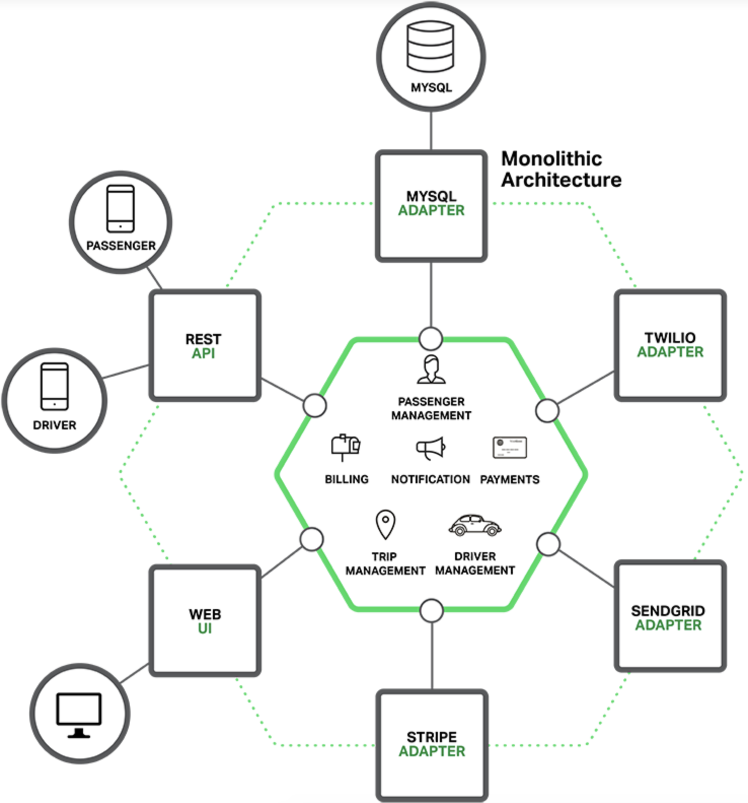
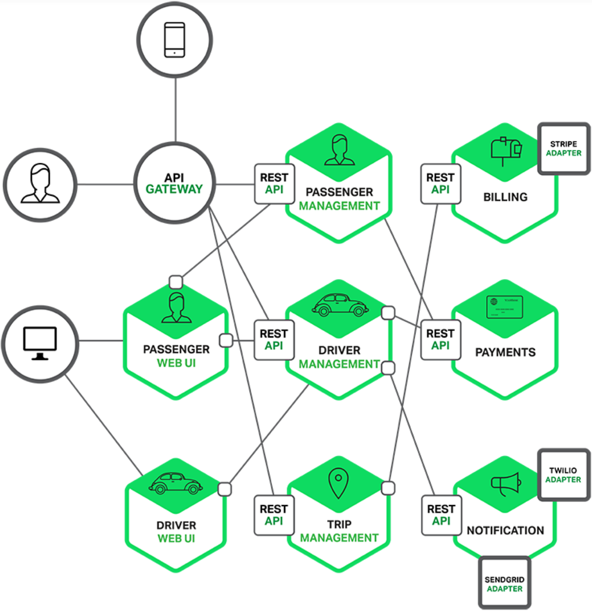
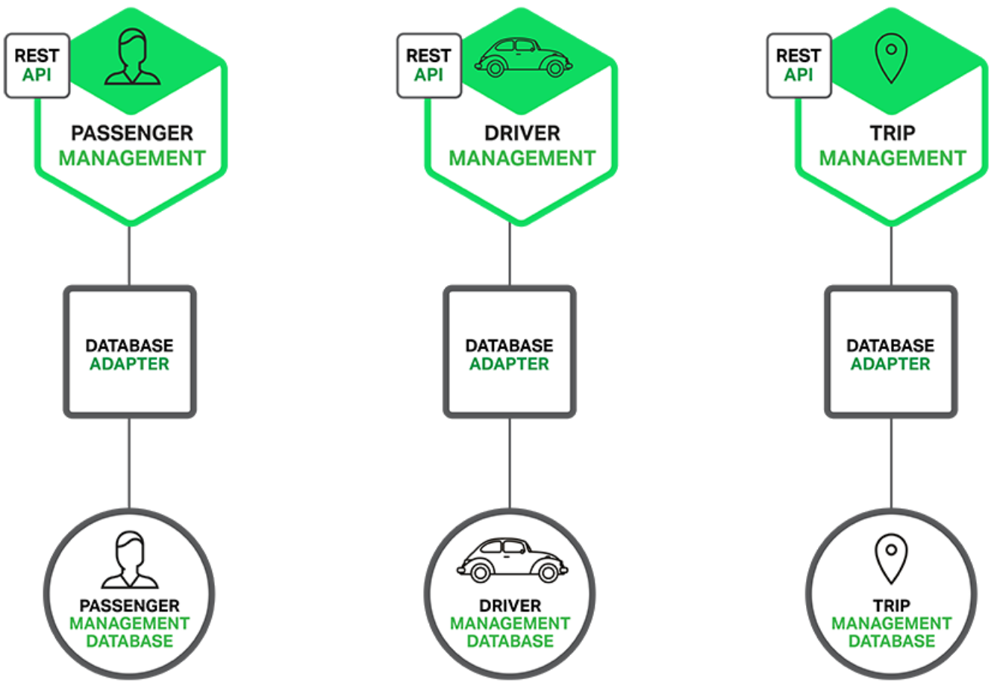

----
* [单体应用](#单体应用)
* [直击痛点](#直击痛点)
* [优势劣势](#优势劣势)
  * [架构优势](#架构优势)
  * [架构劣势](#架构劣势)
----

# 单体应用

> 如下为开发一款类似滴滴的打车软件的需求变现后的常规六边形架构,包括接口(REST API)模块,数据存储(MYSQL)模块,语音电话(TWILIO)模块,电子邮件(SENDGRID)模块,支付(STRIPE)模块,WEBUI模块

* 应用核心是业务逻辑,各种适配器围绕核心与外部交互,虽然基于模块儿化设计,但整个应用仍然以整体打包和部署
* 应用可能随着时间变的臃肿,庞大到任何一个开发者都无法完全理解,开发团队也因此饱受折磨,在敏捷开发和交付的边缘挣扎,最终将导致修复BUG和添加新功能极其困难和耗时,更可怕的是这个是向下的螺旋式发展,最终的结果就是工作没干好反被工作干
* 应用可能单个模块更新而必须重新部署整个应用,部署时间和启动时间都会呈几何形增长
* 应用可能不同模块在资源需求方面也不同,如CPU密集型和IO密集型等,但由于应用被整体打包部署导致无法发挥性能

# 直击痛点

> 已由众多大厂通过采用微服务架构范式解决了上面遇到的同类问题,相比单体应用,微服务架构将应用拆分为一套小且相互关联的服务

* 微服务一般只完成某个特定的功能,如订单管理/客户管理等,每个微服务都是一个微应用,拥有自己的六边形架构,包括业务逻辑和各种接口等
* 微服务通过暴露API接口被其它服务/客户端使用,当然微服务也可以是提供WEBUI实现的微应用

- 微服务通常以实例的形式存在于虚拟机或容器

* 微服务架构下对于应用开放的API接口通常由API Gateway代理转发,使我们可以轻松实现负载均衡,缓存,访问控制,API请求计费,监控等等

* 微服务通常应用都可以有符合自身需求的特定类型的数据库,如为了发现附近乘客,司机管理服务必须使用高效支持地理位置请求的数据库

# 优势劣势

## 架构优势

* 单体应用被分解为多个微应用,每个微应用都有一个基于RPC/API消息驱动的边界,使得单个服务更容易开发,理解和维护
* 每个微服务都可以由专门的开发团队开发,开发者可以自由选择开发技术,只需提供API服务即可
* 每个微服务都可以独立部署,升级,测试,而且可根据每个服务的规模选择满足需求的运行实例

## 架构劣势

* 微服务天然支持分布式,但因此也暴露出其固有的复杂性,开发者需要通过RPC/API来实现进程间通讯
* 微服务通常数据库独立,当需要更新不同服务使用的不同数据库时必须要解决分布式事务一致性的问题
* 微服务单个测试很容易,但当其依赖其它微服务时测试讲变的复杂,需要高度自动化测试方案
* 微服务通常相互网状依赖,部署升级时要需要从底端更新至顶端服务,可能会出现串联效应
* 部署微服务架构的应用很复杂,每个微服务可能多个实例且涉及大量配置,所以需要高度自动化

