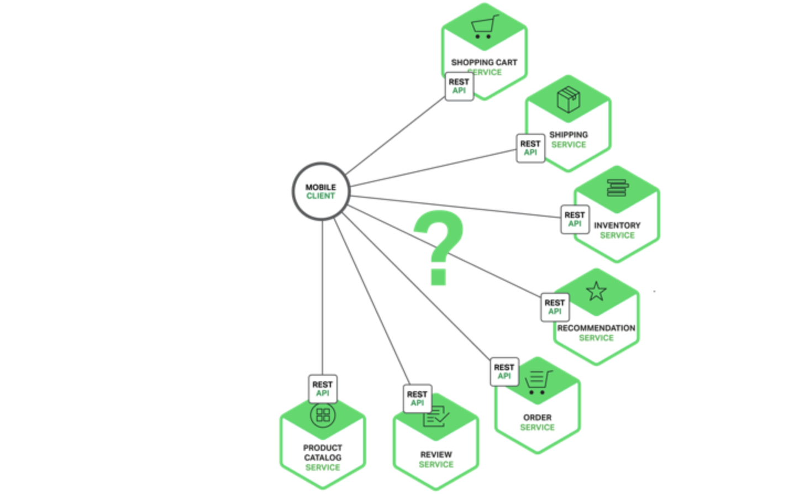
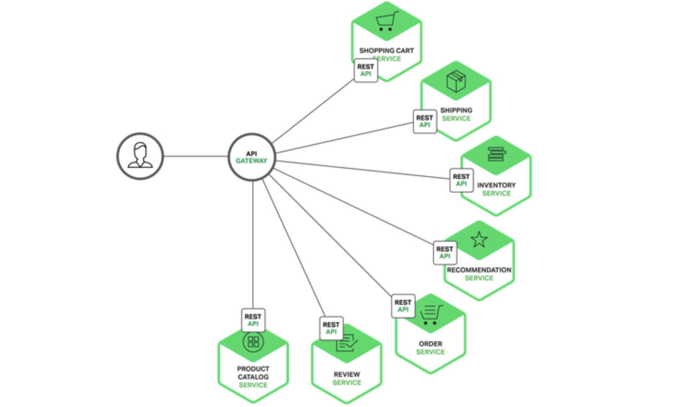
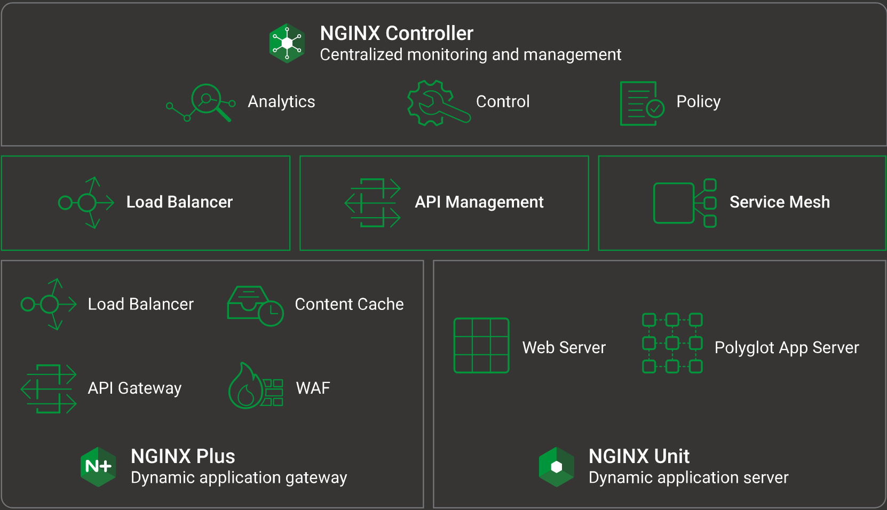

----
* [场景概述](#场景概述)
* [架构对比](#架构对比)
  * [单体架构](#单体架构)
  * [微服务架构](#微服务架构)
* [通信方法](#通信方法)
  * [直接通信](#直接通信)
  * [网关代理](#网关代理)
    * [具体实现](#具体实现)
      * [首选方案](#首选方案)
      * [响应模型](#响应模型)
      * [服务调用](#服务调用)
      * [服务发现](#服务发现)
      * [异常处理](#异常处理)
----

# 场景概述

> 如下为开发一款类似亚马逊购物的原生移动客户端,需要你实现一个产品详情页,展示任意指定商品的信息

* 简单的产品详情页却包含大量信息,包括历史订单,评价,商品基本信息,商品推荐,库存,送货选项等

# 架构对比

## 单体架构

> 通过单体应用模式下,一次移动客户端REST请求会通过前端负载均衡器被路由到N个相同的应用实例中的其中之一,然后应用程序可能查询各种数据库表,并将响应返回给移动客户端

## 微服务架构

> 通常微应用模式下,显示在详情页上的数据会分布在不同的微服务上,比如购物车服务(当前购物车中的件数),订单服务(历史订单),目录服务(商品基本信息,如名称,图片,价格等),评价服务(客户的评价),库存服务(低库存预警),送货服务(送货选项,期现,费用等),推荐服务(推荐商品)

# 通信方法

> 由于单体应用被按照功能拆分为众多微应用,此时移动客户端应该如何去访问这些微服务哪？

## 直接通信

> 理论上微服务支持移动客户端直接访问,每个微服务只要拥有独立公开EndPoint即可像单体应用般通过负载均衡器与后端多实例通信

* 此方式的问题一在于移动客户端需要发送N次独立请求,在移动网络下效率极低,导致移动客户端代码非常复杂
* 此方式的问题二在于对端微服务可能使用不同的协议如二进制RPC,消息传递AMQP等,导致移动客户端代码非常复杂
* 此方式的问题三在于对端微服务可能由于业务调整需要合并或再次拆分时,此时重构会让你显得力不从心

## 网关代理

> 通常通过API网关代理来解决如上的问题,API网关其实是一个服务器,做为微服务的统一入口,封装内部系统的架构,并提供授权,监控,负载均衡,缓存,请求分片,管理,静态响应等处理功能

* 此方式的优点一在于可通过调用多个微服务并合并结果来处理一个请求(/products/1/),内部调用速度非常快
* 此方式的优点二在于并支持在外部Web协议和内部非Web协议之间自动转换,对外暴露友好的Web协议接口

### 具体实现

#### 首选方案

> API网关通常推荐支持异步I/O非阻塞的平台,推荐NginxPlus,做为一个成熟,可扩展,高性能的Web服务器和一个易部署,可配置,可编程的反向代理服务器,并且支持身份认证,访问控制,负载均衡,缓存响应,可感知的健康检查和监控

#### 响应模型

> 为了最小请求时间,对于无依赖的请求合并推荐采用并发请求,对于有依赖的请求推荐使用异步Feature而非地狱式回调Callback

#### 服务调用

> API网关与后端微服务之间的服务调用涉及到进程通信,通常推荐异步AMQP消息代理或同步HTTP消息请求

#### 服务发现

> 由于微服务实例会随着自动扩展和升级而动态变化,API网关需要一种自动发现的机制实时获取后端微服务实例的IP和端口,通常推荐基于服务端的自动发现,也就是说API网关能够通过查询服务注册中心来获取已注册的微服务实例

#### 异常处理

> API网关在进行有或无依赖服务调用时,推荐遵循用户体验优先原则,如多个请求合并时其中一个请求失败则可忽略合并此次请求数据,如单请求失败时但内/外缓存可用状态下,可返回缓存数据

* [Hystrix](https://github.com/Netflix/Hystrix)对于异常处理提供了更加优雅的处理方式,针对API网关到后端微服务单次服务调用启动熔断,隔离,Fallback,Cache,监控等保证单次服务调用的异常不会影响整体服务响应,非JVM应用可以借鉴其思路

